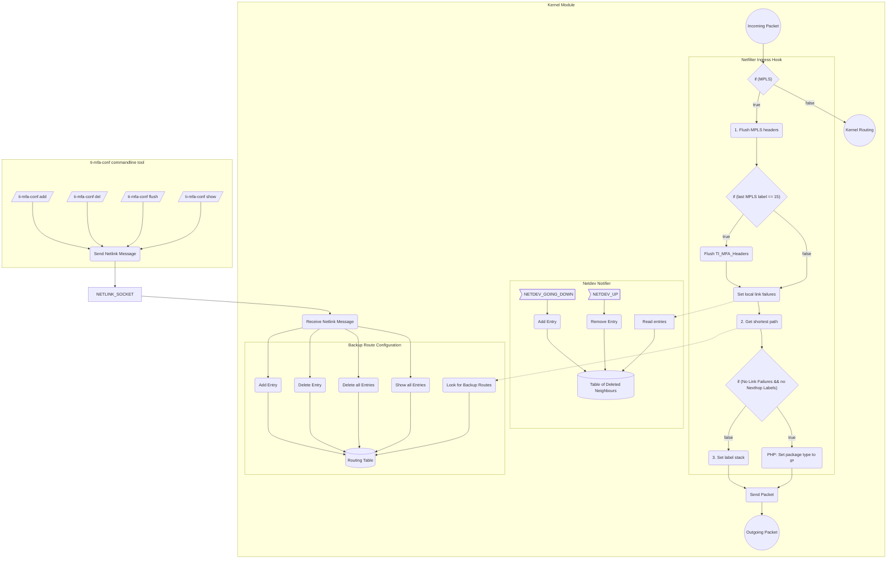
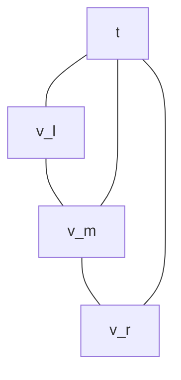
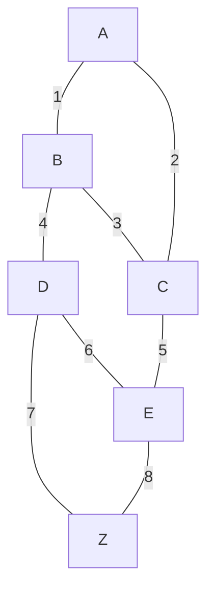

# TI-MFA-linux


**Note:** TI-MFA is currently only implemented for MPLS. Srv6 is not supported (yet).

A Linux kernel module for the Topology Independent Multi Failure Alternate (TI-MFA) algorithm from [^1] ('described from the viewpoint of the node v where the packet hits another failed link'):
>   1) Flush the label stack except for the destination t.
>   2) Based on all link failures stored in the packet header,
>       determine the shortest path P to the destination t in the
>       remaining network G′.
>   3) Add segments to the label stack of the packet as follows:
>
>       • Index the nodes on P as v = v1, v2, …, vx = t.
>           Compute the node vi on P with the highest index s.t. the shortest path from v is identical in G′ (with failures) and G (without failures) and set it as the top of the label stack.
>           If this node is v, push the link (v1, v2 = vi) as the top of the label stack.
>           For the second item on the label stack, start over with vi as the starting node, etc., until vi = t.

## Implementation

### Architecture
Needs Kernel `>= 4.2` (For Ingress Hook)

#### Control plane tool
`ti-mfa-conf` configuration tool for modifying backup routes in case of a link failure:
* adding a route      `ti-mfa-conf add MAC-MAC MPLSLABEL DEV [ NETNS_PID ]`
* deleting a route    `ti-mfa-conf del MAC-MAC MPLSLABEL DEV [ NETNS_PID ]`
* deleting all routes `ti-mfa-conf flush`
* showing all routes  `ti-mfa-conf show`

where
* `MAC` is an Ethernet mac address,
* `MPLSLABEL` is an MPLS label,
* `DEV` is the name of a network interface the packet should be sent out on,
* `NETNS_PID` is optional and the process identifier for whose network namespace the route should be saved.


#### Kernel Module (Data plane)

* PHP: [Penultimate hop popping](https://www.rfc-editor.org/rfc/rfc3031.html#section-3.16)


### Packet Header in Case of Link Failure
```
L2 Header | MPLS Shim Header(s) | MPLS Shim Header with Extension Label (15) | TI-MFA Header(s) | L3 Header
```

### Link Failure Header (TI-MFA Header)
```c
struct ti_mfa_shim_hdr {
    unsigned char link_source[ETH_ALEN];
    unsigned char link_dest[ETH_ALEN];
    unsigned char node_source[ETH_ALEN];
    u8            bos;
};
```

## Tests

The test topologies are configured with static routes.

### Testbed 1
Vagrant boxes with the topology from [^1] :

### Testbed 3
Vagrant boxes with the topology from [^2] :


# Bibliography
[^1]: https://www.univie.ac.at/ct/stefan/gi18.pdf
[^2]: https://conferences.sigcomm.org/sosr/2017/papers/sosr17-demo-sr.pdf
