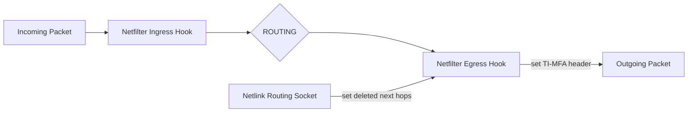

# TI-MFA-linux

A Linux kernel module for the Topology Independent Multi Failure Alternate (TI-MFA) algorithm from [Foerster et al.](https://www.univie.ac.at/ct/stefan/gi18.pdf)

## Architecture
Needs Kernel >= 5.16.0 (For Egress Hook)
